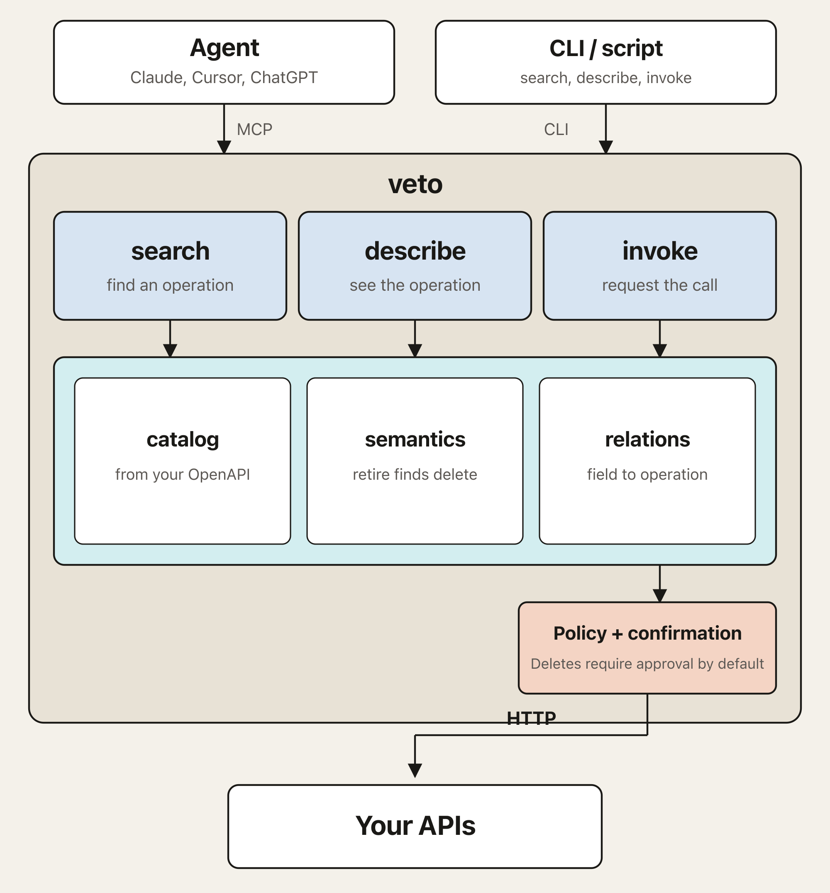

**Turn existing OpenAPI services into tools AI agents can discover and call under your rules.**

The model may request a call. Veto checks policy, requires approval for a destructive call, and resolves credentials before your API runs. Declared relations name a linked operation. A trace records the decision.

**The model proposes. Veto decides. Your API executes.**

Connect over MCP, speak JSON on `veto serve --json`, or embed the Go runtime. They share that runtime. Your services stay where they already run.



```bash
brew install aiveto/veto/veto
```

```bash
go install github.com/aiveto/veto/cmd/veto@latest
```

`brew` does not need Go. `go install` needs Go 1.27.1. Binaries are on [GitHub Releases](https://github.com/aiveto/veto/releases). A release also pushes `ghcr.io/aiveto/veto`.

## See veto in action

[veto-demo](https://github.com/aiveto/veto-demo) is the full walk. Harbor sells home goods. Orders, customers, and billing are the APIs. The walk follows a customer from an order, holds a delete until a person approves it, and keeps the secret out of the trace. `make demo` runs that story over the CLI, then over MCP. `make mcp` leaves Harbor listening and prints the config for Claude, Cursor, or ChatGPT. `make cli` is the same story through search, describe, and invoke.

This repo runs the relation, the held delete, and the redacted trace, then exits. No model key.

```bash
git clone https://github.com/aiveto/veto.git
cd veto
go run ./examples/two-apis
```

```text
Someone asked who placed order 123.
orders.get returned customerId 7.
customers.get was called for 7 because the note said Order.customerId identifies customers.get.
orders.delete sent no HTTP until approved.
The trace left the secret out.
```

## A delete waits

```text
Agent requests the call                          -> pending ID; no upstream HTTP
Person accepts the form in the chat              -> one matching invocation
Host without that form: veto approve <id>        -> approved ID, then the agent submits it once
```

The approval is bound to the caller, the operation, and the parameters. Permission and confirmation run before credentials are fetched and before HTTP. An [OPA](docs/guide.md#policy) allow does not skip those checks. A webhook or a command can notify your approval system. The server and `veto approve` share approval storage and signing configuration. `confirmation: false` in [`veto.yaml`](docs/guide.md#one-vetoyaml) turns that gate off for the deployment. Unset leaves it on.

A per-caller limit stops a call before policy. Timeouts and retries apply to the call that is sent.

## The next call is declared

```yaml
relations:
  - schema: Order
    field: customerId
    to: customers.get
```

Search returns the related operation. Describe returns the note, such as `Order.customerId identifies customers.get`. The Go Follow API walks that link. Invoke runs one operation. [Relations](docs/guide.md#relations).

## What the agent receives

The agent gets search, describe, and invoke. Over MCP the names are `capabilities_search`, `capabilities_describe`, and `capabilities_invoke`. A skill starts with `veto --help-json`, then `veto serve --json`. Each line is one of those three. `veto search`, `describe`, and `invoke` are a shorthand for a human. Direct pins add a few operations beside those three. Grouped mode adds one tool per resource. Search matches the summary, tags, the path noun, and synonyms such as retire for delete. An overlay can add a word of your own.

[Response shaping](docs/guide.md#mcp) returns named fields and a bounded list, and marks pagination and truncation. A Go [context pack](docs/guide.md#pack) holds rules, operation summaries, the conversation, relations, and a pending confirmation, inside a byte budget. The raw OpenAPI document stays out of the pack.

## Connect your services

[`veto init`](docs/guide.md#one-vetoyaml) writes `veto.yaml` for the OpenAPI files or URLs you name, and a `relations.yaml` stub if you do not have one. If `veto.yaml` is already there, `init` stops.

```bash
veto init orders.yaml customers.yaml
```

`veto serve --stdio` speaks MCP on stdin. `veto serve --json` speaks the same three capabilities as JSON lines. [Authenticated Streamable HTTP](docs/guide.md#remote-mcp) serves the same runtime to a remote client.

Credentials come from the environment, OAuth, a caller-supplied token, token exchange, a command that returns headers, or a Go provider that signs the request. The agent does not perform that login. [Authentication](docs/guide.md#auth).

## Check it

| Task | How |
| --- | --- |
| The catalog loads, and its operation count and joins are printed | [`validate`](docs/guide.md#one-vetoyaml) |
| Missing auth, a colliding operation id, or a parameter that cannot be sent | [`doctor`](docs/guide.md#doctor) |
| The request and the policy decision, before a token is fetched and before HTTP | [`preview`](docs/guide.md#preview) |
| Run a case | [`eval`](docs/guide.md#check-in-ci) |
| Fail when a joined operation disappears, confirmation or a permission is dropped, a new destructive operation appears, or a case expectation changes. `confirmation: false` is the record of a deployment-wide drop | [`check --against`](docs/guide.md#check-in-ci) |
| Print a saved trace | [`replay --from`](docs/guide.md#replay) |
| Run a message | [`replay`](docs/guide.md#replay) |
| Share contracts, relations, and cases apart from deployment credentials | [capability bundle](docs/guide.md#capability-bundle) |
| Call the same runtime from your own Go module | [generate](docs/guide.md#generate) a client, a CLI, and an MCP dispatch package |

Traces are OpenTelemetry. OTLP export is optional. The Go model and memory interfaces, and sequential flows, run in-process. They are not a durable workflow service.

```bash
veto validate --config testdata/veto.yaml
veto eval --config testdata/veto.yaml --case testdata/delete.yaml
veto serve --config testdata/veto.yaml --stdio
veto serve --config testdata/veto.yaml --json
```

`testdata/veto.yaml` is already written, so these commands start at `validate`. `eval` runs the delete case in this repo. `--stdio` is MCP. `--json` is a skill. A call needs an API that is still listening, which is what veto-demo keeps up.

## Scope

**Pre-1.0.** Public APIs may change.

[Setup guide](docs/guide.md) | [Current limits](docs/guide.md#limits)
